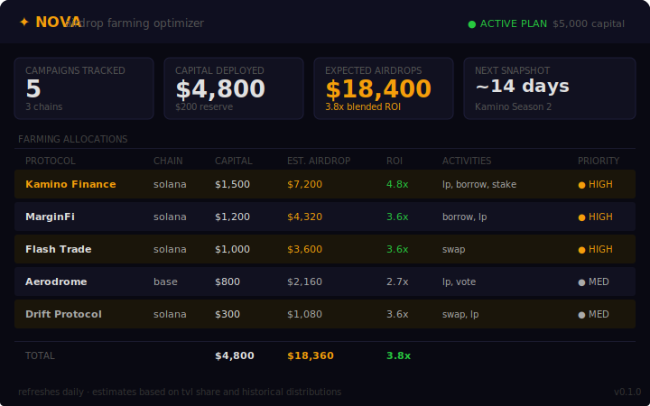
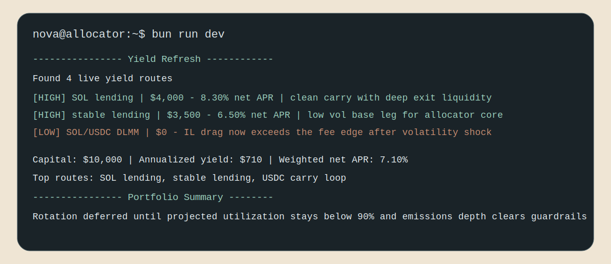

<div align="center">

# Nova

**Autonomous airdrop farming optimizer.**
Tracks every live points campaign. Estimates expected value. Allocates your capital where the ROI is highest.

[](https://github.com/NovaFarming/NovaFarming/actions)

[](https://docs.anthropic.com/en/docs/agents-and-tools/claude-agent-sdk)
[](https://www.typescriptlang.org/)

</div>

---

Airdrop farming is a capital allocation problem. You have limited capital and dozens of campaigns — each with different activity requirements, snapshot timelines, and estimated values. Getting it wrong means grinding low-ROI campaigns while missing the ones that actually pay out.

`Nova` maintains a registry of active airdrop campaigns, estimates expected value per dollar deployed using TVL share and historical distribution patterns, and asks Claude to build the optimal allocation plan given your capital and minimum ROI requirements.

```
DISCOVER → ESTIMATE → ALLOCATE → TRACK → REFRESH
```

---

## Farming Dashboard



---

## Terminal Output



---

## Architecture

```
┌────────────────────────────────────────────────────┐
│            Campaign Registry                        │
│   Active campaigns · Chain · Activities            │
│   Estimated value · TVL · Funding round            │
└───────────────────────┬────────────────────────────┘
                        ▼
┌────────────────────────────────────────────────────┐
│          Claude Farming Agent                       │
│   get_active_campaigns → get_campaign_details      │
│   → estimate_airdrop_value → submit_farming_plan   │
└───────────────────────┬────────────────────────────┘
                        ▼
┌────────────────────────────────────────────────────┐
│           Portfolio Tracker                         │
│   Allocation display · Points balance              │
│   Daily refresh · ROI tracking                    │
└────────────────────────────────────────────────────┘
```

---

## Prioritization Logic

| Priority | Criteria |
|----------|---------|
| **HIGH** | Expected value > $2,000 · ROI > 3x · achievable activities |
| **MEDIUM** | Expected value $500–$2,000 · ROI 1.5–3x |
| **LOW / Skip** | EV < $500 or ROI < 1.5x |

---

## Supported Campaigns (built-in)

| Protocol | Chain | Activities | Status |
|----------|-------|-----------|--------|
| Kamino Finance | Solana | lp, borrow, stake | Active |
| MarginFi | Solana | borrow, lp | Active |
| Flash Trade | Solana | swap | Active |
| Aerodrome | Base | lp, vote | Active |
| Drift Protocol | Solana | swap, lp | Active |

Add your own campaigns by extending `src/campaigns/registry.ts`.

---

## Quick Start

```bash
git clone https://github.com/NovaFarming/NovaFarming
cd NovaFarming && bun install
cp .env.example .env
bun run dev
```

---

## Configuration

```bash
ANTHROPIC_API_KEY=sk-ant-...
TOTAL_CAPITAL_USD=5000
MIN_ROI=1.5
MIN_ESTIMATED_VALUE_USD=500
TRACKED_CHAINS=solana,base,arbitrum
REFRESH_INTERVAL_MS=86400000    # daily
```

---

## License

MIT

---

*find the farms. skip the noise. collect the drops.*
